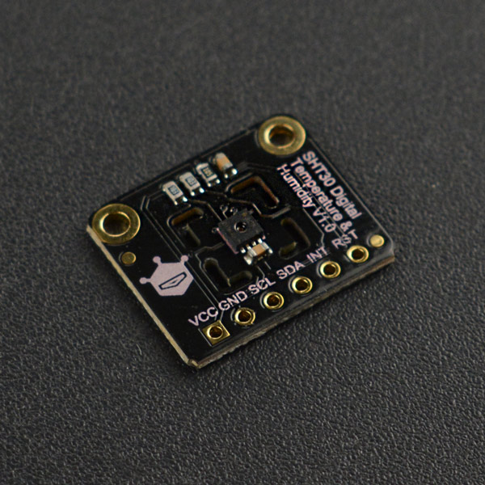
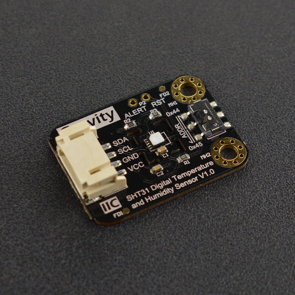

# DFRobot_SHT3x
- [中文版](./README_CN.md)

The SHT3x series chips are used to measure ambient temperature and relative humidity (the degree of moisture in the air, which indicates the degree to which the moisture content in the atmosphere is saturated from the atmosphere). <br>
It is a successor to the SHT2x series that contain the low-cost version of the SHT30, the standard version of SHT31, and the professional version of SHT35.<br>
The SHT3x series temperature and humidity sensors adopt IIC communication which is easy to use, with a wide operating voltage range (2.15 to 5.5 V), and a space area of the chip package is 2.5 x 2.5 mm2 and 0.9 mm high, which can help SHT3x be easily integrated into a wide range of applications for a wide range of scenarios.<br>
Based on brand-new optimized CMOSens® chip, SHT3x further improved its product reliability and accuracy specifications.<br>
SHT3x offers a range of new features, e.g. enhanced signal processing, two unique user-selectable I2C addresses, an alarm mode with programmable temperature and humidity limits, and communication speeds up to 1 MHz.<br>
<br>
You can choose to open or not open the heater
Heater Function<br>
①By comparing the relative humidity and temperature values measured before and after heating, it is possible to determine whether the sensor is working properly.<br>
②Using heaters in wet environments can avoid sensor condensation.<br>
③A heater can also measure the dew point temperature (the temperature at which water vapor in the air turns into dewdrops).<br>
The SHT3x chip offers two modes of operation:<br>
1.Single measurement mode with an idle state current of 0.2 mA and low power consumption (measurement data is 600 mA).<br>
2.Cycle measurement mode, where the idle state current is 45 mA, and in this mode ALERT starts to work(measurement data is 600 mA)<br>
The following is the typical measurement accuracy of the chip (followed by this temperature and humidity range):<br>

Version No.|Typical Temp Precision (°C)|Typical Humidity Precision(%RH)| Range(Temp/Humidity)
-----------|:-------------------------:|:-----------------------------:|:----------------------
SHT30      |     ±0.2  @0-65 °C        |        ±2 @10-90% RH          |  -40-125 °C/0-100 %RH 
SHT31      |     ±0.2  @0-90 °C        |        ±2 @0-100% RH          |  -40-125 °C/0-100 %RH 
SHT35      |     ±0.1  @20-60°C        |        ±1.5 @0-80% RH         |  -40-125 °C/0-100 %RH 






## Product Link（https://www.dfrobot.com/product-2016.html）

   SEN0330:Fermion: SHT30 Digital Temperature & Humidity Sensor (Breakout)<br>
   SEN0331:Fermion: SHT31 Digital Temperature & Humidity Sensor (Breakout)<br>
   SEN0332:Fermion: SHT31-F Digital Temperature & Humidity Sensor (Breakout)<br>
   SEN0333:Fermion: SHT35 Digital Temperature & Humidity Sensor (Breakout)<br>
   SEN0334:Gravity: SHT31-F Digital Temperature and Humidity Sensor<br>
## Table of Contents

* [Summary](#summary)
* [Installation](#installation)
* [Methods](#methods)
* [Compatibility](#compatibility)
* [History](#history)
* [Credits](#credits)

## Summary

   1.Read repeatability of the temperature and humidity data in single measurement mode, users can select the measure repeatability(the difference between the data measured by the chip under the same measurement conditions).<br>
     The higher the repeatability is, the smaller the difference and the more dependable data will be.<br>
   2.Read repeatability of the temperature and humidity data in cycle measurement mode, users can select the measure repeatability and the measure frequency(0.5Hz,1Hz,2Hz,4Hz,10Hz).<br>
   3.The user can customize the threshold range. The ALERT pin and the Arduino's interrupt pin can achieve the effect of the temperature and humidity threshold alarm.<br>
## Installation
To use this library, please download the library file first, and paste it into the \Arduino\libraries directory, then open the examples folder and run the demo in the folder.

## Methods

```C++
  /**
   * @fn readSerialNumber
   * @brief Read the serial number of the chip
   * @return 32-digit serial number
   */
  uint32_t  readSerialNumber();
  
  /**
   * @fn begin
   * @brief Initialize the function
   * @return Return 0 indicates a successful initialization, while other values indicates failure and return to error code.
   */
  int begin();
  
  /**
   * @fn softReset
   * @brief Send command resets via iiC, enter the chip's default mode single-measure mode, 
   * turn off the heater, and clear the alert of the ALERT pin.
   * @return Read the status register to determine whether the command was executed successfully, and returning true indicates success
   */
  bool softReset();
  
  /**
   * @fn pinReset
   * @brief Reset through the chip's reset pin, enter the chip's default mode single-measure mode, and clear the alert of the ALERT pin.
   * @return The status register has a data bit that detects whether the chip has been reset, and returning true indicates success
   */
  bool pinReset();
  
  /**
   * @fn readTemperatureAndHumidity
   * @brief Get temperature and humidity data in single measurement mode.
   * @param repeatability Set repeatability to read temperature and humidity data with the type eRepeatability_t.
   * @return Return a structure containing celsius temperature (°C), Fahrenheit temperature (°F), relative humidity (%RH), status code
   * @n A status of 0 indicates the right return data.
   */
  sRHAndTemp_t readTemperatureAndHumidity(eRepeatability_t repeatability );
  
  /**
   * @fn getTemperatureC
   * @brief Get the measured temperature (in degrees Celsius)
   * @return Return the float temperature data 
   */
  float getTemperatureC();
  
  /**
   * @fn getTemperatureF
   * @brief Get the measured temperature (in degrees Fahrenheit)
   * @return Return the float temperature data 
   */
  float getTemperatureF();
  
  /**
   * @fn getHumidityRH
   * @brief Get measured humidity(%RH)
   * @return Return the float humidity data
   */
  float getHumidityRH();
  
  /**
   * @fn startPeriodicMode
   * @brief Enter cycle measurement mode and set repeatability(the difference between the data measured 
   * the difference between the data measured by the chip under the same measurement conditions)
   * @param measureFreq  Read the eMeasureFrequency_t data frequency
   * @param repeatability  Set repeatability to read temperature and humidity data with the type eRepeatability_t. 
   * eRepeatability_High(high repeatability mode) in default.
   * @return Return true indicates a successful entrance to cycle measurement mode.
   */
  bool startPeriodicMode(eMeasureFrequency_t measureFreq,eRepeatability_t repeatability = eRepeatability_High);
  
  /**
   * @fn readTemperatureAndHumidity
   * @brief Get temperature and humidity data in cycle measurement mode.
   * @return Return a structure containing celsius temperature (°C), Fahrenheit temperature (°F), relative humidity (%RH), status code
   * @n A status of 0 indicates the right return data.
   */
  sRHAndTemp_t readTemperatureAndHumidity();
  
  /**
   * @fn stopPeriodicMode
   * @brief Exit from cycle measurement mode
   * @return Read the status of the register to determine whether the command was executed successfully, and returning true indicates success
   */
  bool stopPeriodicMode();
  
  /**
   * @fn heaterEnable
   * @brief Turn on the heater inside the chip
   * @return Read the status of the register to determine whether the command was executed successfully, and returning true indicates success
   * @note Heaters should be used in wet environments, and other cases of use will result in incorrect readings
   */
  bool heaterEnable();
  
  /**
   * @fn heaterDisable
   * @brief Turn off the heater inside the chip
   * @return Read the status of the register to determine whether the command was executed successfully, and returning true indicates success
   * @note Heaters should be used in wet environments, and other cases of use will result in incorrect readings
   */
  bool heaterDisable();
  
  /**
   * @fn clearStatusRegister
   * @brief All flags (Bit 15, 11, 10, 4) in the status register can be cleared (set to zero)
   * @n  Set bit:15 to 0 so that ALERT pin can work, otherwise it will keep high.
   */
  void clearStatusRegister();
  
  /**
   * @fn readAlertState
   * @brief Read the state of the pin ALERT.
   * @return High returns 1, low returns 0.
   */
  bool readAlertState();
  
  /**
   * @fn environmentState
   * @brief Determine if the temperature and humidity are out of the threshold range
   * @return Return the status code, representing as follows
   * @retval 01 ：Indicates that the humidity exceeds the lower threshold range
   * @retval 10 ：Indicates that the temperature exceeds the lower threshold range
   * @retval 11 ：Indicates that both the humidity and the temperature exceed the lower threshold range
   * @retval 02 ：Indicates that the humidity exceeds the upper threshold range
   * @retval 20 ：Indicates that the temperature exceeds the upper threshold range
   * @retval 22 ：Indicates that both the humidity and the temperature exceed the upper threshold range
   * @retval 12 ：Indicates that the temperature exceeds the lower threshold range,
   * @n and the humidity exceeds the upper threshold range
   * @retval 21 ：Indicates that the temperature exceeds the upper threshold range,
   * @n and the humidity exceeds the lower threshold range
   */
  uint8_t environmentState();
  
  /**
   * @fn setTemperatureLimitC
   * @brief Set the threshold temperature and alarm clear temperature(°C)
   * @param highset  High temperature alarm point, when the temperature is greater than this value, the ALERT pin generates an alarm signal.
   * @param highClear  High temperature alarm clear point, alarming when the temp higher than the highset, otherwise the alarm signal will be cleared.
   * @param lowset  Low temperature alarm point, when the temperature is lower than this value, the ALERT pin generates an alarm signal.
   * @param lowclear  Low temperature alarm clear point, alarming when the temp lower than the highset, otherwise the alarm signal will be cleared.
   * @note range: -40 to 125 degrees Celsius, highset > highClear > lowclear > lowset. 
   * @return  A return to 0 indicates a successful setting.
   */
  uint8_t  setTemperatureLimitC(float highset,float highclear,float lowset,float lowclear);
  
  /**
   * @fn setTemperatureLimitF
   * @brief Set the threshold temperature and alarm clear temperature(°F)
   * @param highset  High temperature alarm point, when the temperature is greater than this value, the ALERT pin generates an alarm signal.
   * @param highClear High temperature alarm clear point, alarming when the temp higher than the highset, otherwise the alarm signal will be cleared.
   * @param lowset Low temperature alarm point, when the temperature is lower than this value, the ALERT pin generates an alarm signal.
   * @param lowclear Low temperature alarm clear point, alarming when the temp lower than the highset, otherwise the alarm signal will be cleared.
   * @note Range: -40 to 257 (Fahrenheit), highset > highClear > lowclear > lowset.
   * @return  A return to 0 indicates a successful setting.
   */
  uint8_t  setTemperatureLimitF(float highset,float highclear, float lowset,float lowclear);

  /**
   * @fn setHumidityLimitRH
   * @brief Set the relative humidity threshold temperature and the alarm clear humidity(%RH)
   * @param highset  High humidity alarm point, when the humidity is greater than this value, the ALERT pin generates an alarm signal.
   * @param highClear  High humidity alarm clear point, alarming when the humidity higher than the highset, otherwise the alarm signal will be cleared.
   * @param lowset  Low humidity alarm point, when the humidity is lower than this value, the ALERT pin generates an alarm signal.
   * @param lowclear  Low humidity alarm clear point, alarming when the humidity lower than the highset, otherwise the alarm signal will be cleared.
   * @note range: 0 - 100 %RH, highset > highClear > lowclear > lowset 
   * @return: A return to 0 indicates a successful setting.
   */
  uint8_t setHumidityLimitRH(float highset,float highclear, float lowset,float lowclear);
  
  /**
   * @fn measureTemperatureLimitC
   * @brief Measure temperature threshold temperature and alarm clear temperature
   * @return Return true indicates successful data acquisition
   */
  bool measureTemperatureLimitC();
  
  /**
   * @fn getTemperatureHighSetC
   * @brief Get high temperature alarm points(°C)
   * @return Return high temperature alarm points(°C)
   */
  float getTemperatureHighSetC();
  
  /**
   * @fn getTemperatureHighClearC
   * @brief Get high temperature alarm clear points(°C)
   * @return Return high temperature alarm clear points(°C)
   */
  float getTemperatureHighClearC();
  
  /**
   * @fn getTemperatureLowClearC
   * @brief Get low temperature alarm clear points(°C)
   * @return Return low temperature alarm clear points(°C)
   */
  float getTemperatureLowClearC();
  
  /**
   * @fn getTemperatureLowSetC
   * @brief Get low temperature alarm points(°C)
   * @return Return low temperature alarm points
   */
  float getTemperatureLowSetC();
  
  /**
   * @fn measureTemperatureLimitF
   * @brief Measure the threshold temperature and alarm clear temperature
   * @return Return true indicates successful data acquisition
   */
  bool measureTemperatureLimitF();
  
  /**
   * @fn getTemperatureHighSetF
   * @brief Get high temperature alarm points(°F)
   * @return Return high temperature alarm points(°F)
   */
  float getTemperatureHighSetF();
  
  /**
   * @fn getTemperatureHighClearF
   * @brief Get high temperature alarm clear points(°F)
   * @return Return high temperature alarm clear points(°F))
   */
  float getTemperatureHighClearF();
  
  /**
   * @fn getTemperatureLowClearF
   * @brief Get low temperature alarm clear points(°F)
   * @return Return low temperature alarm clear points(°F)
   */
  float getTemperatureLowClearF();
  
  /**
   * @fn getTemperatureLowSetF
   * @brief Get low temperature alarm points(°F)
   * @return Return low temperature alarm points
   */
  float getTemperatureLowSetF();
  
  /**
   * @fn measureHumidityLimitRH
   * @brief Measure the threshold humidity of relative humidity and alarm clear humidity
   * @return Return true indicates successful data acquisition
   */
  bool measureHumidityLimitRH();
  
  /**
   * @fn getHumidityHighSetRH
   * @brief Get the high humidity alarm point(%RH)
   * @return Return the high humidity alarm point
   */
  float getHumidityHighSetRH();

  /**
   * @fn getHumidityHighClearRH
   * @brief Get the high humidity alarm clear point(%RH)
   * @return Return the high humidity alarm clear point
   */
  float getHumidityHighClearRH();
  
  /**
   * @fn getHumidityLowClearRH
   * @brief Get the low humidity alarm clear point(%RH)
   * @return Return the low humidity alarm clear point
   */
  float getHumidityLowClearRH();
  
  /**
   * @fn getHumidityLowSetRH
   * @brief Get the low humidity alarm point
   * @return Return the low humidity alarm point
   */
  float getHumidityLowSetRH();

```

## Compatibility

MCU                | Work Well    | Work Wrong   | Untested    | Remarks
------------------ | :----------: | :----------: | :---------: | -----
Arduino uno        |      √       |              |             | 
Mega2560        |      √       |              |             | 
Leonardo        |      √       |              |             | 
ESP32           |      √       |              |             | 
micro:bit        |      √       |              |             | 

## History

- 2019/08/25 - Version 1.0.0 released.

## Credits

Written by fengli(li.feng@dfrobot.com), 2019.8.25 (Welcome to our [website](https://www.dfrobot.com/))


