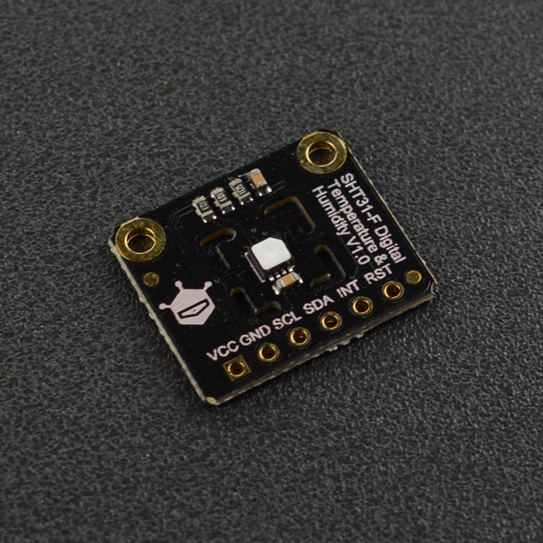
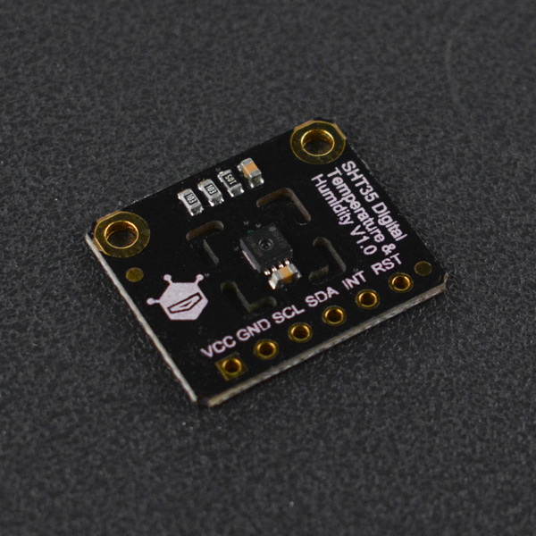

# DFRobot_SHT3x
- [English Version](./README.md)

SHT3x系列芯片用于测量环境温度和相对湿度(空气中的潮湿程度，它表示大气中水汽含量距离大气饱和的程度)，它是SHT2x系列的继承者，包括低成本版本SHT30、标准版本SHT31，以及高端版本SHT35<br>
SHT3x系列温湿度传感器通过IIC通信，使用比较方便，工作电压范围宽(2.15至5.5 V)，芯片封装的占位面积<br>
为2.5 × 2.5 mm2，高度为0.9 mm,这有助于SHT3x集成到多种应用,适合各类场景<br>
SHT3x建立在全新和优化的CMOSens® 芯片之上，进一步提高了产品可靠性和精度规格。SHT3x提供了一系列新功能，<br>
如增强信号处理、两个独特的用户可选的I2C地址、一个可编程温湿度极限的报警模式，以及高达1 MHz的通信速度<br>
在使用过程中可选择是否打开加热器<br>
     加热器作用：<br>
       ①通过比较加热前后测出的相对湿度值及温度值，可确定传感器是否正常工作；<br>
       ②在潮湿环境下使用加热器，可避免传感器凝露；<br>
       ③测量露点温度(空气中的水蒸气变为露珠时候的温度)时也需要使用加热器。<br>
SHT3x芯片提供两种工作模式:<br>
1.单次测量模式，此模式下空闲状态电流为0.2微安，功耗较低(测量数据时600 微安).<br>
2.周期测量模式，此模式下空闲状态电流为45微安，此模式下ALERT开始工作(测量数据时600 微安).<br>
以下是芯片典型的测量精度(@后面是在此温湿度范围下)：<br>

版本号               | 典型温度精度 (°C)    | 典型湿度精度 (%RH)  | 测量范围(温度/湿度)
--------------------| :-------------------: | :---------------------: | -----
SHT30        |    ±0.2 @0-65 °C |        ±2 @10-90% RH     |     -40-125 °C/0-100 %RH 
SHT31       |     ±0.2  @0-90 °C   |        ±2 @0-100% RH     |  -40-125 °C/0-100 %RH 
SHT35       |     ±0.1  @20-60 °C  |          ±1.5 @0-80% RH  |  -40-125 °C/0-100 %RH 






## 产品链接（https://www.dfrobot.com.cn/goods-2695.html）

   SEN0330:Fermion: SHT30数字温湿度传感器<br>
   SEN0331:Fermion: SHT31数字温湿度传感器<br>
   SEN0332:Fermion: SHT31-F数字温湿度传感器<br>
   SEN0333:Fermion: SHT35-F数字温湿度传感器(Breakout)<br>
   SEN0334:Gravity: SHT31-F数字温湿度传感器<br>

## 目录

  * [概述](#概述)
  * [库安装](#库安装)
  * [方法](#方法)
  * [兼容性](#兼容性)
  * [历史](#历史)
  * [创作者](#创作者)

## 概述
   1.在单次测量模式下读取环境温湿度，用户可以选择测量的可重复性(芯片在两次相同测量条件下测量到的数据的差值)<br>
     可重复性越高，差值越小,数据越可靠<br>
   2.在周期测量模式下读取环境温湿度,用户可以选择测量的可重复性和测量频率(0.5Hz,1Hz,2Hz,4Hz,10Hz)<br>
   3.利用ALERT引脚和Arduino的中断引脚达到温湿度超阈值报警的效果，用户可自定义阈值大小<br>

## 库安装

要使用这个库，首先下载库文件，将其粘贴到\Arduino\libraries目录中，然后打开示例文件夹并在文件夹中运行演示程序。


## 方法

```C++

/**
 * @fn readSerialNumber
 * @brief 读取芯片的序列号
 * @return 返回32位序列号
 */
uint32_t  readSerialNumber();

/**
 * @fn begin
 * @brief 初始化函数
 * @return 返回0表示初始化成功，返回其他值表示初始化失败，返回错误码
 */
int begin();

/**
 * @fn softReset
 * @brief 通过IIC发送命令复位，进入芯片的默认模式单次测量模式，关闭加热器，并清除ALERT引脚的警报。
 * @return 通过读取状态寄存器来判断命令是否成功被执行，返回true则表示成功
 */
bool softReset();

/**
 * @fn pinReset
 * @brief 通过芯片的复位引脚进行复位，进入芯片的默认模式单次测量模式，并清除ALERT引脚的警报。
 * @return 状态寄存器有一数据位能检测芯片是否进行了复位，返回true则表示成功
 */
bool pinReset();

/**
 * @fn readTemperatureAndHumidity
 * @brief 在单次测量模式下获取温湿度数据
 * @param repeatability 设置读取温湿度数据的可重复性，eRepeatability_t类型的数据
 * @return 返回包含摄氏温度(°C),华氏温度(°F),相对湿度(%RH),状态码的结构体
 * @n 状态为0表示返回数据正确
 */
sRHAndTemp_t readTemperatureAndHumidity(eRepeatability_t repeatability );

/**
 * @fn getTemperatureC
 * @brief 获取测量到的温度(单位：摄氏度)
 * @return 返回float类型的温度数据
 */
float getTemperatureC();

/**
 * @fn getTemperatureF
 * @brief 获取测量到的温度(单位：华氏度)
 * @return 返回float类型的温度数据
 */
float getTemperatureF();

/**
 * @fn getHumidityRH
 * @brief 获取测量到的湿度(单位：%RH)
 * @return 返回float类型的湿度数据
 */
float getHumidityRH();

/**
 * @fn startPeriodicMode
 * @brief 进入周期测量模式，并设置可重复性(芯片在两次相同测量条件下测量到的数据的差值)、读取频率。
 * @param measureFreq  读取数据的频率，eMeasureFrequency_t类型的数据
 * @param repeatability 设置读取温湿度数据的可重复性，eRepeatability_t类型的数据,默认为eRepeatability_High(高重复性)
 * @return 返回true表示进入周期模式成功。
 */
bool startPeriodicMode(eMeasureFrequency_t measureFreq,eRepeatability_t repeatability = eRepeatability_High);

/**
 * @fn readTemperatureAndHumidity
 * @brief 在周期测量模式下获取温湿度数据.
 * @return 返回包含摄氏温度(°C),华氏温度(°F),相对湿度(%RH),状态码的结构体
 * @n 状态为0表示返回数据正确
 */
sRHAndTemp_t readTemperatureAndHumidity();

/**
 * @fn stopPeriodicMode
 * @brief 从周期读取数据模式退出。
 * @return 通过读取状态寄存器来判断命令是否成功被执行，返回true则表示成功
 */
bool stopPeriodicMode();

/**
 * @fn heaterEnable
 * @brief 打开芯片里面的加热器.
 * @return 通过读取状态寄存器来判断命令是否成功被执行，返回true则表示成功
 * @note 加热器的使用条件，应是在潮湿环境时，若正常情况下使用则会造成读数不准.
 */
bool heaterEnable();

/**
 * @fn heaterDisable
 * @brief 关闭芯片里面的加热器.
 * @return 通过读取状态寄存器来判断命令是否成功被执行，返回true则表示成功
 * @note 加热器的使用条件，应是在潮湿环境时，若正常情况下使用则会造成读数不准.
 */
bool heaterDisable();

/**
 * @fn clearStatusRegister
 * @brief All flags (Bit 15, 11, 10, 4) in the status register can be cleared (set to zero)
 * @n  把bit：15 设置为0后ALERT引脚才能正常工作，否则将一直处于高电平。
 */
void clearStatusRegister();

/**
 * @fn readAlertState
 * @brief 读取ALERT引脚的状态.
 * @return 高电平则返回1，低电平则返回0.
 */
bool readAlertState();

/**
 * @fn environmentState
 * @brief 判断温湿度超出阈值范围的情况 
 * @return 返回状态码,状态码代表含义如下：
 * @n 01 ：表示湿度超过下阈值范围
 * @n 10 ：表示温度超过下阈值范围
 * @n 11 ：表示温湿度都超过下阈值范围
 * @n 02 ：表示湿度超过上阈值范围
 * @n 20 ：表示温度超过上阈值范围
 * @n 22 ：表示温湿度都超过上阈值范围
 * @n 12 ：表示温度超过下阈值范围,湿度超过上阈值范围
 * @n 21 ：表示温度超过上阈值范围,湿度超过下阈值范围
 */
uint8_t environmentState();

/**
 * @fn setTemperatureLimitC
 * @brief 设置温度阈值温度和警报清除温度(°C)
 * @param highset 高温报警点，当温度大于此值时ALERT引脚产生报警信号。
 * @param highClear 高温警报清除点，当温度大于highset产生报警信号，而温度小于此值报警信号则被清除。
 * @param lowset 低温报警点，当温度小于此值时ALERT引脚产生报警信号。
 * @param lowclear 低温警报清除点，当温度小于lowset产生报警信号，而温度大于此值时报警信号则被清除
 * @note 范围：-40 到 125 ,highset>highClear>lowclear>lowset。 
 * @return 返回0则表示设置成功.
 */
uint8_t  setTemperatureLimitC(float highset,float highclear,float lowset,float lowclear);

/**
 * @fn setTemperatureLimitF
 * @brief 设置温度阈值温度和警报清除温度(°F)
 * @param highset 高温报警点，当温度大于此值时ALERT引脚产生报警信号。
 * @param highClear 高温警报清除点，当温度大于highset产生报警信号，而温度小于此值报警信号则被清除。
 * @param lowset 低温报警点，当温度小于此值时ALERT引脚产生报警信号。
 * @param lowclear 低温警报清除点，当温度小于lowset产生报警信号，而温度大于此值时报警信号则被清除。
 * @note 范围：-40 到 257 ,highset>highClear>lowclear>lowset。 
 * @return 返回0则表示设置成功.
 */
uint8_t  setTemperatureLimitF(float highset,float highclear, float lowset,float lowclear);

/**
 * @fn setHumidityLimitRH
 * @brief 设置相对湿度阈值温度和警报清除湿度(%RH)
 * @param highset 高湿度报警点，当相对湿度大于此值时ALERT引脚产生报警信号。
 * @param highClear 高湿度警报清除点，当相对湿度大于highset产生报警信号，而相对湿度小于此值报警信号则被清除。
 * @param lowset 低湿度报警点，当相对湿度小于此值时ALERT引脚产生报警信号。
 * @param lowclear 低湿度警报清除点，当相对湿度小于lowset产生报警信号，而相对湿度大于此值时报警信号则被清除。
 * @note 范围：0 - 100 %RH,highset>highClear>lowclear>lowset。
 * @return 返回0则表示设置成功.
 */
uint8_t setHumidityLimitRH(float highset,float highclear, float lowset,float lowclear);

/**
 * @fn measureTemperatureLimitC
 * @brief 测量温度阈值温度和警报清除温度
 * @return 返回true 表示数据获取成功
 */
bool measureTemperatureLimitC();

/**
 * @fn getTemperatureHighSetC
 * @brief 获取高温报警点温度(°C)
 * @return 返回高温报警点温度
 */
float getTemperatureHighSetC();

/**
 * @fn getTemperatureHighClearC
 * @brief 获取高温警报清除点温度(°C)
 * @return 返回高温警报清除点温度
 */
float getTemperatureHighClearC();

/**
 * @fn getTemperatureLowClearC
 * @brief 获取低温警报清除点温度(°C)
 * @return 返回低温警报清除点温度
 */
float getTemperatureLowClearC();

/**
 * @fn getTemperatureLowSetC
 * @brief 获取低温报警点温度(°C)
 * @return 返回低温报警点温度
 */
float getTemperatureLowSetC();

/**
 * @fn measureTemperatureLimitF
 * @brief 测量相对湿度阈值温度和警报清除湿度
 * @return 返回true 表示数据获取成功
 */
bool measureTemperatureLimitF();

/**
 * @fn getTemperatureHighSetF
 * @brief 获取高温报警点温度(°F)
 * @return 返回高温报警点温度
 */
float getTemperatureHighSetF();

/**
 * @fn getTemperatureHighClearF
 * @brief 获取高温警报清除点温度(°F)
 * @return 返回高温警报清除点温度
 */
float getTemperatureHighClearF();

/**
 * @fn getTemperatureLowClearF
 * @brief 获取低温警报清除点温度(°F)
 * @return 返回低温警报清除点温度
 */
float getTemperatureLowClearF();

/**
 * @fn getTemperatureLowSetF
 * @brief 获取低温报警点温度(°F)
 * @return 返回低温报警点温度
 */
float getTemperatureLowSetF();

/**
 * @fn measureHumidityLimitRH
 * @brief 读取相对湿度阈值温度和警报清除湿度
 * @return 返回true 表示数据获取成功
 */
bool measureHumidityLimitRH();

/**
 * @fn getHumidityHighSetRH
 * @brief 获取高湿度报警点湿度(%RH)
 * @return 返回高湿度报警点湿度
 */
float getHumidityHighSetRH();

/**
 * @fn getHumidityHighClearRH
 * @brief 获取高湿度警报清除点湿度(%RH)
 * @return 返回高湿度警报清除点湿度
 */
float getHumidityHighClearRH();

/**
 * @fn getHumidityLowClearRH
 * @brief 获取低湿度警报清除点湿度(%RH)
 * @return 返回低湿度警报清除点湿度
 */
float getHumidityLowClearRH();

/**
 * @fn getHumidityLowSetRH
 * @brief 获取低湿度报警点湿度(v)
 * @return 返回低湿度报警点湿度
 */
float getHumidityLowSetRH();


```

## 兼容性

主板               | 通过  | 未通过   | 未测试   | 备注
------------------ | :----------: | :----------: | :---------: | -----
Arduino uno        |      √       |              |             | 
Mega2560        |      √       |              |             | 
Leonardo        |      √       |              |             | 
ESP32           |      √       |              |             | 
micro:bit        |      √       |              |             | 


## 兼容性

- 2019/08/25 - 1.0.0 版本

## 创作者

Written by fengli(li.feng@dfrobot.com), 2019.8.25 (Welcome to our [website](https://www.dfrobot.com/))


