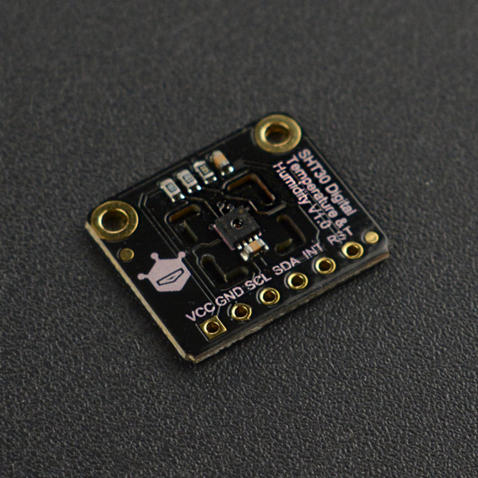
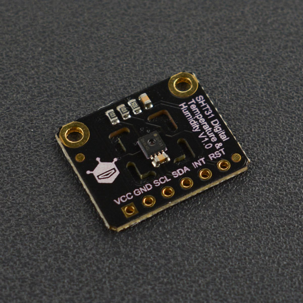
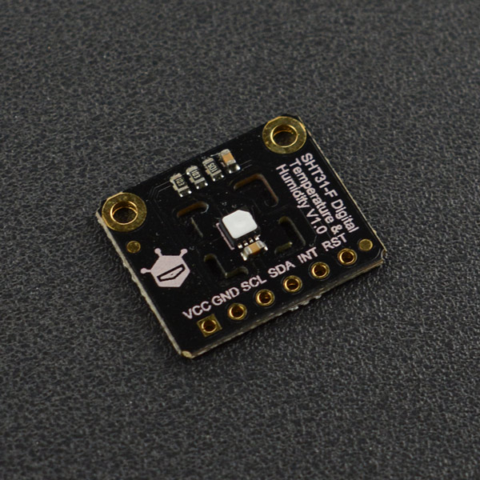
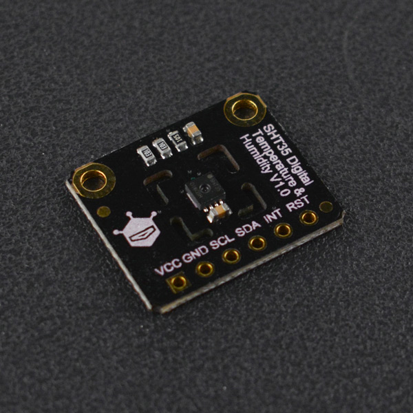
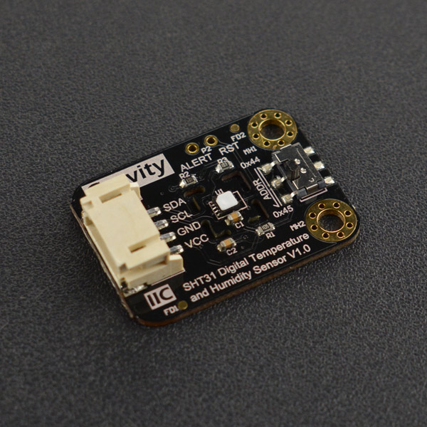

# DFRobot_SHT3x
- [中文版](./README_CN.md)

The SHT3x series chips are used to measure ambient temperature and relative humidity (the degree of moisture in the air, which indicates the degree to which the moisture content in the atmosphere is saturated from the atmosphere). 
It is a successor to the SHT2x series that contain the low-cost version of the SHT30, the standard version of SHT31, and the professional version of SHT35.
The SHT3x series temperature and humidity sensors adopt IIC communication which is easy to use, with a wide operating voltage range (2.15 to 5.5 V), and a space area of the chip package is 2.5 x 2.5 mm2 and 0.9 mm high, which can help SHT3x be easily integrated into a wide range of applications for a wide range of scenarios.
Based on brand-new optimized CMOSens® chip, SHT3x further improved its product reliability and accuracy specifications.
SHT3x offers a range of new features, e.g. enhanced signal processing, two unique user-selectable I2C addresses, an alarm mode with programmable temperature and humidity limits, and communication speeds up to 1 MHz.

You can choose to open or not open the heater
Heater Function
①By comparing the relative humidity and temperature values measured before and after heating, it is possible to determine whether the sensor is working properly.
②Using heaters in wet environments can avoid sensor condensation.
③A heater can also measure the dew point temperature (the temperature at which water vapor in the air turns into dewdrops).
The SHT3x chip offers two modes of operation:
1.Single measurement mode with an idle state current of 0.2 mA and low power consumption (measurement data is 600 mA).
2.Cycle measurement mode, where the idle state current is 45 mA, and in this mode ALERT starts to work(measurement data is 600 mA)
The following is the typical measurement accuracy of the chip (followed by this temperature and humidity range):

| Version No. | Typical Temp Precision (°C) | Typical Humidity Precision(%RH) | Range(Temp/Humidity) |
| ----------- | :-------------------------: | :-----------------------------: | :------------------- |
| SHT30       |       ±0.2  @0-65 °C        |          ±2 @10-90% RH          | -40-125 °C/0-100 %RH |
| SHT31       |       ±0.2  @0-90 °C        |          ±2 @0-100% RH          | -40-125 °C/0-100 %RH |
| SHT35       |       ±0.1  @20-60°C        |         ±1.5 @0-80% RH          | -40-125 °C/0-100 %RH |







## Product Link（https://www.dfrobot.com/product-2016.html）

   SEN0330:Fermion: SHT30 Digital Temperature & Humidity Sensor (Breakout)<br>
   SEN0331:Fermion: SHT31 Digital Temperature & Humidity Sensor (Breakout)<br>
   SEN0332:Fermion: SHT31-F Digital Temperature & Humidity Sensor (Breakout)<br>
   SEN0333:Fermion: SHT35 Digital Temperature & Humidity Sensor (Breakout)<br>
   SEN0334:Gravity: SHT31-F Digital Temperature and Humidity Sensor<br>
## Table of Contents

* [Summary](#summary)
* [Installation](#installation)
* [Methods](#methods)
* [Compatibility](#compatibility)
* [History](#history)
* [Credits](#credits)

## Summary

   1.Read repeatability of the temperature and humidity data in single measurement mode, users can select the measure repeatability(the difference between the data measured by the chip under the same measurement conditions).<br>
    The higher the repeatability is, the smaller the difference and the more dependable data will be.<br>
   2.Read repeatability of the temperature and humidity data in cycle measurement mode, users can select the measure repeatability and the measure frequency(0.5Hz,1Hz,2Hz,4Hz,10Hz).<br>
   3.The user can customize the threshold range. The ALERT pin and the Arduino's interrupt pin can achieve the effect of the temperature and humidity threshold alarm.<br>

## Installation
To use this library, first download the library to Raspberry Pi, then open the routines folder. To execute one routine, demox.py, type python demox.py on the command line. To execute the get_gyro_accel_temp_data.py routine, for example, you need to type:

```
python periodic_data_reading.py
```


## Methods

```python

  def begin(self,RST = 4):
    '''!
       @brief Initialize the function
       @return Return 0 indicates a successful initialization, while other values indicates failure and return to error code.
    '''
	
  def read_serial_number(self):
    '''!
      @brief Read the serial number of the chip
      @return 32-digit serial number
    '''

  def soft_reset(self):
    '''!
       @brief Send command resets via iiC, enter the chip's default mode single-measure mode, 
       turn off the heater, and clear the alert of the ALERT pin.
       @return Read the status register to determine whether the command was executed successfully, and returning true indicates success
    '''

  def pin_reset(self):
    '''!
       @brief Reset through the chip's reset pin, enter the chip's default mode single-measure mode, and clear the alert of the ALERT pin.
       @return The status register has a data bit that detects whether the chip has been reset, and returning true indicates success
    '''

  def stop_periodic_mode(self):
    '''!
       @brief Exit from cycle measurement mode
       @return Read the status of the register to determine whether the command was executed successfully, and returning true indicates success
    '''

  def heater_enable(self):
    '''!
       @brief Turn on the heater inside the chip
       @return Read the status of the register to determine whether the command was executed successfully, and returning true indicates success
       @note Heaters should be used in wet environments, and other cases of use will result in incorrect readings
    '''

  def heater_disable(self):
    '''!
       @brief Turn off the heater inside the chip
       @return Read the status of the register to determine whether the command was executed successfully, and returning true indicates success
       @note Heaters should be used in wet environments, and other cases of use will result in incorrect readings
    '''

  def clear_status_register(self):
    '''!
      @brief All flags (Bit 15, 11, 10, 4) in the status register can be cleared (set to zero)
      @n  Set bit:15 to 0 so that ALERT pin can work, otherwise it will keep high.
    '''

  def read_alert_state(self):
    '''!
       @brief Read the state of the pin ALERT.
       @return High returns 1, low returns 0.
    '''

  def read_temperature_and_humidity(self,repeatability = repeatability_periodic):
    '''!
      @brief Get temperature and humidity data in single measurement mode.
      @param repeatability: The mode of reading data
      @n                    repeatability_high = 0    #/**<In high repeatability mode, the humidity repeatability is 0.10%RH, the temperature repeatability is 0.06°C*/
      @n                    repeatability_medium = 1  #/**<In medium repeatability mode, the humidity repeatability is 0.15%RH, the temperature repeatability is 0.12°C*/
      @n                    repeatability_low = 2     #/**<In low repeatability mode, the humidity repeatability is0.25%RH, the temperature repeatability is 0.24°C*/
      @n                    repeatability_periodic = 3  Periodic reading of data
      @return Return a list containing celsius temperature (°C), Fahrenheit temperature (°F), relative humidity (%RH), status code
      @n A status of 0 indicates the right return data.
    '''

  def get_temperature_C(self):
    '''!
       @brief Get the measured temperature (in degrees Celsius)
       @return Return the float temperature data 
    '''

  def get_temperature_F(self):
    '''!
       @brief Get the measured temperature (in degrees Fahrenheit)
       @return Return the float temperature data 
    '''

  def get_humidity_RH(self):
    '''!
       @brief Get measured humidity(%RH)
       @return Return the float humidity data
    '''

  def start_periodic_mode(self,measure_freq,repeatability = repeatability_high):
    '''!
       @brief Enter cycle measurement mode and set repeatability(the difference between the data measured 
       the difference between the data measured by the chip under the same measurement conditions)
       @param measure_freq  Read the  data frequency
       @n                  measureFreq_0_5Hz = 0
       @n                  measureFreq_1Hz = 1
       @n                  measureFreq_2Hz = 2
       @n                  measureFreq_4Hz = 3
       @n                  measureFreq_10Hz = 4
       @param repeatability The mode of reading data,repeatability_high in default.
       @n                    repeatability_high = 0    #/**<In high repeatability mode, the humidity repeatability is 0.10%RH, the temperature repeatability is 0.06°C*/
       @n                    repeatability_medium = 1  #/**<In medium repeatability mode, the humidity repeatability is 0.15%RH, the temperature repeatability is 0.12°C*/
       @n                    repeatability_low = 2     #/**<In low repeatability mode, the humidity repeatability is0.25%RH, the temperature repeatability is 0.24°C*/
       @return Return true indicates a successful entrance to cycle measurement mode.
    '''

  def __read_status_register(self):
    '''!
       @brief Read the data stored in the status register.
       @return Return to status like whether heater is ON or OFF, the status of the pin alert, reset status and the former cmd is executed or not.
    '''

  def environment_state(self):
    '''!
      @brief Determine if the temperature and humidity are out of the threshold range
      @return Return the status code, representing as follows
      @n 01 ：Indicates that the humidity exceeds the lower threshold range
      @n 10 ：Indicates that the temperature exceeds the lower threshold range
      @n 11 ：Indicates that both the humidity and the temperature exceed the lower threshold range
      @n 02 ：Indicates that the humidity exceeds the upper threshold range
      @n 20 ：Indicates that the temperature exceeds the upper threshold range
      @n 22 ：Indicates that both the humidity and the temperature exceed the upper threshold range
      @n 12 ：Indicates that the temperature exceeds the lower threshold range,
              and the humidity exceeds the upper threshold range
      @n 21 ：Indicates that the temperature exceeds the upper threshold range,
              and the humidity exceeds the lower threshold range
    '''

  def set_temperature_limit_C(self,high_set,high_clear, low_set,low_clear):
    '''!
       @brief Set the threshold temperature and alarm clear temperature(°C)
       @param highset: High temperature alarm point, when the temperature is greater than this value, the ALERT pin generates an alarm signal.
       @param highClear: High temperature alarm clear point, alarming when the temp higher than the highset, otherwise the alarm signal will be cleared.
       @param lowset: Low temperature alarm point, when the temperature is lower than this value, the ALERT pin generates an alarm signal.
       @param lowclear: Low temperature alarm clear point, alarming when the temp lower than the highset, otherwise the alarm signal will be cleared.
       @note range: -40 to 125 degrees Celsius, highset > highClear > lowclear > lowset. 
       @return: A return to 0 indicates a successful setting.
    '''

  def set_temperature_limit_F(self,high_set,high_clear, low_set,low_clear):
    '''!
       @brief Set the threshold temperature and alarm clear temperature(°F)
       @param highset High temperature alarm point, when the temperature is greater than this value, the ALERT pin generates an alarm signal.
       @param highClear High temperature alarm clear point, alarming when the temp higher than the highset, otherwise the alarm signal will be cleared.
       @param lowset Low temperature alarm point, when the temperature is lower than this value, the ALERT pin generates an alarm signal.
       @param lowclear Low temperature alarm clear point, alarming when the temp lower than the highset, otherwise the alarm signal will be cleared.
       @note Range -40 to 257 (Fahrenheit), highset > highClear > lowclear > lowset.
       @return A return to 0 indicates a successful setting.
    '''

  def set_humidity_limit_RH(self,high_set,high_clear, low_set,low_clear):
    '''!
       @brief Set the relative humidity threshold temperature and the alarm clear humidity(%RH)
       @param highset  High humidity alarm point, when the humidity is greater than this value, the ALERT pin generates an alarm signal.
       @param highClear  High humidity alarm clear point, alarming when the humidity higher than the highset, otherwise the alarm signal will be cleared.
       @param lowset  Low humidity alarm point, when the humidity is lower than this value, the ALERT pin generates an alarm signal.
       @param lowclear  Low humidity alarm clear point, alarming when the humidity lower than the highset, otherwise the alarm signal will be cleared.
       @note range  0 - 100 %RH, highset > highClear > lowclear > lowset 
       @return  A return to 0 indicates a successful setting.
    '''

  def measure_temperature_limit_C(self):
    '''!
       @brief Measure temperature threshold temperature and alarm clear temperature
       @return Return true indicates successful data acquisition
    '''

  def measure_temperature_limit_F(self):
    '''!
       @brief Measure the threshold temperature and alarm clear temperature
       @return Return true indicates successful data acquisition
    '''

  def measure_humidity_limit_RH(self):
    '''!
       @brief Measure the threshold humidity of relative humidity and alarm clear humidity
       @return Return true indicates successful data acquisition
    '''

  def get_temperature_high_set_F(self):
    '''!
       @brief Get high temperature alarm points(°F)
       @return Return high temperature alarm points(°F)
    '''

  def get_temperature_high_clear_F(self):
    '''!
       @brief Get high temperature alarm clear points(°F)
       @return Return high temperature alarm clear points(°F))
    '''

  def get_temperature_low_clear_F(self):
    '''!
       @brief Get low temperature alarm clear points(°F)
       @return Return low temperature alarm clear points(°F)
    '''
	
  def get_temperature_low_set_F(self):
    '''!
       @brief Get low temperature alarm points(°F)
       @return Return low temperature alarm points
    '''

  def get_temperature_high_set_C(self):
    '''!
       @brief Get high temperature alarm points(°C)
       @return Return high temperature alarm points(°C)
    '''

  def get_temperature_high_clear_C(self):
    '''!
       @brief Get high temperature alarm clear points(°C)
       @return Return high temperature alarm clear points(°C)
    '''

  def get_temperature_low_clear_C(self):
    '''!
       @brief Get low temperature alarm clear points(°C)
       @return Return low temperature alarm clear points(°C)
    '''

  def get_temperature_low_set_C(self):
    '''!
       @brief Get low temperature alarm points(°C)
       @return Return low temperature alarm points
    '''

  def get_humidity_high_set_RH(self):
    '''!
       @brief Get the high humidity alarm point(%RH)
       @return Return the high humidity alarm point
    '''

  def get_humidity_high_clear_RH(self):
    '''!
       @brief Get the high humidity alarm clear point(%RH)
       @return Return the high humidity alarm clear point
    '''

  def get_humidity_low_clear_RH(self):
    '''!
       @brief Get the low humidity alarm clear point(%RH)
       @return Return the low humidity alarm clear point
    '''

  def get_humidity_low_set_RH(self):
    '''!
       @brief Get the low humidity alarm point
       @return Return the low humidity alarm point
    '''

```

## Compatibility

* RaspberryPi Version

| Board        | Work Well | Work Wrong | Untested | Remarks |
| ------------ | :-------: | :--------: | :------: | ------- |
| RaspberryPi2 |           |            |    √     |         |
| RaspberryPi3 |           |            |    √     |         |
| RaspberryPi4 |     √     |            |          |         |

* Python Version

| Python  | Work Well | Work Wrong | Untested | Remarks |
| ------- | :-------: | :--------: | :------: | ------- |
| Python2 |     √     |            |          |         |
| Python3 |     √     |            |          |         |


## History

- 2021/06/11 - Version 1.0.0 released.

## Credits

Written by yangfeng(feng.yang@dfrobot.com), 2021 (Welcome to our [website](https://www.dfrobot.com/))


